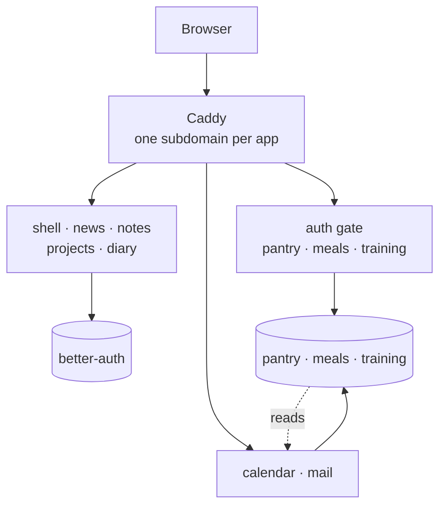

# Saganta Suite


A personal life platform you host yourself: calendar, mail, notes, projects,
pantry, meals, training and a daily briefing. The apps are allowed to read each
other, because they all sit on your server.



## Why self-hosted and not rented

The appeal of this suite is that the apps read each other: the calendar knows
what is in your pantry, the briefing knows what your day looks like. That is
exactly what end-to-end encryption against the operator forbids, because **a
server that cannot read cannot plan**.

The resolution is not less encryption but a different operator: **the one server
allowed to read everything is yours.** Hence a thing you host, not a service you
rent.

The same thought from the other side: a life platform holds, by its nature,
special categories of personal data (medical appointments in the calendar,
training data, letters from your doctor in the mail app). Running that for other
people brings obligations that do not fit a one-person operation.

## The six parts

| Part | What it does |
|---|---|
| `saganta` | shell, sign-in, news, notes, projects, mail and diary front ends |
| `kalender` | appointments, tasks, habits, day type |
| `postfach` | scanning letters, OCR, filing |
| `lager` | household inventory |
| `mealprep` | recipes, weekly plan, shopping list |
| `fitness` | training and progress |

Each stays a repository of its own, because each stands on its own: the calendar
is run elsewhere as a single service. `holen.sh` clones them into `teile/`;
`docker-compose.yml` pulls them in with `include:`, so there is one truth per
service instead of a copy in here.

## Getting it up

```bash
SAGANTA_GIT_BASIS=https://github.com/<account> ./holen.sh

# Write a .env with your domain, TLS mode and data path.
# ENV_VORLAGE.md explains every field and why it is there.
printf 'SAGANTA_DOMAENE=example.org\nSAGANTA_TLS=\nPOSTFACH_DATEN=./daten/postfach\n' > .env

./einrichten.sh        # generates the secrets and writes them where they belong
./pruefen.py           # looks for what a valid compose file will not show you
docker compose up -d
```

Leave `SAGANTA_TLS` empty for real certificates from Let's Encrypt, or set it to
`internal` to let Caddy use its own authority. The second option matters more
than it sounds: several apps need a secure context, because the browser only
hands out geolocation and WebCrypto there.

Then open `https://<domain>`, create the first account, and record its id:
`./einrichten.sh --kennung <sub>`.

## Secrets are generated, never typed

A good dozen secrets are needed, and several of them have to be **identical in
several places** while others have to **differ**. Typing them by hand produces
exactly one typo, and it does not announce itself: the service runs, it just
answers 401, and only once someone turns on strict checking weeks later.

`einrichten.sh` is the single place that gets this right. It never overwrites an
existing value, it is safe to run twice, and it identifies placeholders by their
**key** rather than by their text, so renaming a placeholder in a template does
not silently leave it in place.

## What `pruefen.py` looks for

A compose file that passes `config` is valid, not correct. Three failures look
perfectly healthy and only surface in operation:

- A virtual host points at a service that does not exist. Everything is green
  and exactly one address answers 502.
- A virtual host points at a service the entrance shares no network with. Same
  effect, different cause, invisible in the compose file.
- A secret that must match in several places does not. The stack runs and
  answers every request with 401.

All three happened while this was being built, which is why the check exists.

## Notes from building it

Two compose projects with the same name are **one** project to Docker. Naming
this one `saganta` would have made `docker compose up` adopt the running
containers of a separately operated stack of that name and replace them.

The three app gateways come from a single template, and that template is written
for one of the three apps. Copied unchanged, all three proxy the same backend:
the pantry page loads and shows your training data. Nothing about it looks like
an error.

## License

AGPL-3.0. If you run this as a service for other people, publish your changes.

If that does not work for you, a commercial licence is available: write to
<sami@djouhri.de>. Contributions require the rights grant in `CONTRIBUTING.md`,
which is what keeps that option open.
Running it at home for yourself has no such consequence.

## About this snapshot

This is the umbrella repository. It carries no application code, only what is
needed to run the six parts together: the compose file, the entrance, the
templates and the setup scripts.

The development history stays private; the public one starts at the first
release and grows with each one.
